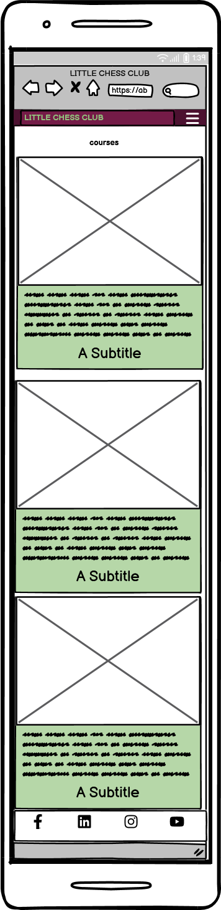

# Little Chess Club

## Table of Contents
 + [Purpose](#purpose)
 + [UX Wireframe](#wireframe)
 + [Responsiveness](#responsiveness)
 + [Navigation](#navigation)
 + [Courses Page](#courses-page)
 + [Contact Us Page](#contact-us-page)
 + [Footer Section](#footer-section)
 + [Testing](#testing)
 + [DevTools](#devtools)
 + [Bugs](#bugs)
 + [Fixin](#fixing)
 + [Validation](#validation)
 + [HTML](#html)
 + [CSS](#css)
 + [Accessibility](#accessibility)
 + [Credits](#credits)
 + [Technologies Used](#technologies-used)
 + [Languages Used](#languages-used)
 + [Websites](#websites)
 + [Content](#content)
 + [Media](#media)
 + [Acknowledgements](#acknowledgements)
 + [Softwares](#softwares)
 + [Deployment](#deployment)
 + [Steps](#steps)
 + [Conclusion](#conclusion)
 
## Purpose
Wellcome to [Little Chess Club](https://abdurrahimb.github.io/chess-club/) Website!

This wesite is intended to the Chess loving people who wants to learn how to play chess. If they want to learn playing chess or even they want their children to learn and grow interest. This website offers information about benifits of playing chess. They will find information about the positive impact of playing chess by the recreational players or even pupils of ADHD and Dementia. The website offers three different courses on a different page called "Courses" and interested people who wants to sign up can contact us in a different page called Contact Us. This is a fully responsive website. People can access the site from their mobile phones all the way upto any size over 1200px.

## Wireframe
I have used balsamiq to produce wireframes. Here i share the screenshots of related work both by mobile and desktop.

  + Mobile 

    |   |   |

  + Desktop

  index

  

 Courses

   

  Contact Us

  

## Responsiveness
 

## Navigation
  + Mobile

Just Nav Bar

  + Desktop

 

## Courses Page

 + Mobile

 + Desktop

## Contact Us Page

 + Mobile

 + Desktop

## Footer Section

 

## Testing

I have tested the site manually which looked fine on all devices. I checked the form filled out and send on from both sizes. It successfully submitted to the server. Fields needs to have inputs, email field needs a valid email address, set minlength in the fileds. 

## DevTools

With the chrome devtool, I checked, Which looked all good. It has good performance on lighthouse scoring system.
All the three pages screenshots are here
  + This is score of the Home Page, it is satisfactory to me as a developper.

  + This is the score of the courses page, it is satisfactory to me as a developper.

  + This is the score of the Contact Us Page, it is satisfactory to me as a developper.
  

## Bugs

  + Result
  
I found a bug when the site finished. It was  

  + Fixing

  When I was doing validation, I found a bug and used   and solved.

## Validation

I have used HTML and Css validators for all three pages and stylesheet. There was no errors or warning.

+ HTML

[HTML Validator through W3C Marup validation service](https://jigsaw.w3.org/css-validator/#validate_by_input)

Home Page

Courses Page

Contact Us Page

+ CSS

[W3C CSS Validation Service](https://jigsaw.w3.org/css-validator/#validate_by_input)

 + Stylesheet

+ Accessibility with Lighthouse

## Credits
[Code Institute](https://learn.codeinstitute.net/)

## Technologies Used
 + GitHub
 + GitPod

## Languages Used
  + HTML5
  + CSS

### Websites
1. Responsive Screensostes[Website](https://ui.dev/amiresponsive)
2. Website Ideas from [Love Running Project](https://abdurrahimb.github.io/Love-Running/)
3. Icons from [Fontawesome](https://fontawesome.com/)
4. Fonts from [Google Fonts](https://fonts.google.com/)
5. Code learning from [W3schools](https://www.w3schools.com/)
6. Favicon[Website]()
7. Mark Down Table of Contents Tutorial [Youtube](https://www.youtube.com/watch?v=EKqhENATIKg)
8. Adding images to .md tutorial [Youtube](https://www.youtube.com/watch?v=Ljj1wGFJqPY)

### Content
### Media
### Acknowledgements
My lovely classmates on Code Institute, Tutors and My Mentor Mr. Alan Bushell. 

### Softwares
I have used different softwares to prepare this site. Here are the used softwares
  + Wireframe Tutorial [Balsamiq](https://www.youtube.com/watch?v=E5Z1QOly72E)
  + Adobe Photoshop
  + Windows Image Resizer
  + [Online image converter to .webp](https://convertio.co/jpg-webp/)

## Adding README.md
  + Tutorial from [Youtube](https://www.youtube.com/watch?v=M8ra1n2oiTY)
## Deployment
## Steps

## Conclusion